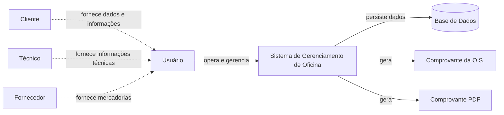

# Escopo e Contexto

## Dentro do escopo atual

- autenticação de usuários para acesso às funcionalidades internas;
- cadastro e consulta de clientes PF/PJ, incluindo contatos, endereço e observações;
- cadastro de técnicos;
- cadastro de serviços, com valor padrão e tempo estimado de execução;
- cadastro de produtos, incluindo preços e estoque mínimo;
- cadastro de fornecedores e vínculo com produtos fornecidos;
- registro de entrada de mercadorias e atualização do estoque;
- alerta quando a quantidade de um produto atingir ou ficar abaixo do estoque mínimo;
- abertura de Ordem de Serviço vinculada a cliente e veículo;
- cadastro automático de veículo durante a abertura da O.S. quando a placa ainda não estiver cadastrada;
- adição, edição e remoção de produtos da O.S., com atualização correspondente do estoque;
- adição, edição e remoção de serviços da O.S., permitindo definir o valor cobrado e o técnico responsável;
- registro e alteração do diagnóstico técnico da O.S.;
- atualização do status da O.S.;
- cancelamento de Ordens de Serviço;
- finalização da O.S. com registro da forma de pagamento;
- aplicação opcional de desconto percentual ou em valor na finalização da O.S.;
- emissão e impressão de comprovante da O.S.;
- geração do comprovante em PDF;
- consulta de Ordens de Serviço por número da O.S., cliente, placa do veículo ou status.

## Fora do escopo ou não evidenciado

- agendamento de serviços e controle de agenda da oficina;
- emissão de nota fiscal;
- integração com sistemas fiscais ou contábeis;
- contas a pagar e contas a receber;
- parcelamento e processamento de pagamentos pelo próprio sistema;
- integração direta com máquinas de cartão, PIX ou instituições financeiras;
- geração de pedidos de compra para fornecedores;
- controle de múltiplas filiais ou estoques separados;
- inventário físico de estoque;
- notificações por e-mail, SMS;
- integração com sistemas externos;
- relatórios gerenciais, financeiros ou de estoque;
- acesso direto ao sistema por clientes ou técnicos.

Os itens acima não devem ser interpretados como inexistentes na implementação; apenas não aparecem na fonte analisada.

## Contexto do sistema

## Premissas

- o acesso às funcionalidades internas exige usuário autenticado;
- clientes podem ser Pessoa Física ou Pessoa Jurídica;
- cada cliente pode possuir um ou mais contatos;
- veículos são vinculados aos clientes e identificados pela placa;
- um veículo ainda não cadastrado pode ser registrado durante a abertura de uma O.S.;
- produtos possuem código único, preços, quantidade em estoque e estoque mínimo;
- entradas de mercadoria aumentam a quantidade disponível em estoque;
- produtos utilizados em uma O.S. alteram a quantidade disponível em estoque;
- serviços possuem valor padrão e tempo estimado de execução;
- o valor de um serviço pode ser alterado especificamente para uma O.S. sem modificar seu valor padrão;
- técnicos recém-cadastrados iniciam com situação `Ativo`;
- somente técnicos ativos podem ser selecionados como responsáveis por serviços;
- toda O.S. inicia com status `Aberta`;
- uma O.S. pode seguir de `Aberta` para `Em andamento` ou ser `Cancelada`;
- o status `Concluída` é definido somente durante a finalização da O.S.;
- a finalização registra a forma de pagamento e pode incluir desconto;
- a emissão de comprovante não altera os dados registrados na O.S.
