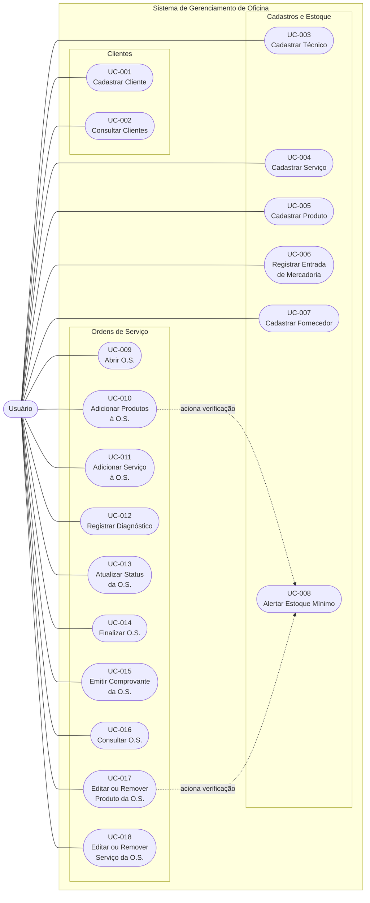

# Índice de Casos de Uso

| ID     | Caso de uso                                                                       | Ator principal | Estado documental |
| ------ | --------------------------------------------------------------------------------- | -------------- | ----------------- |
| UC-001 | [[UC-001 - Cadastrar cliente\|Cadastrar cliente]]                                 | Usuário        | em revisão        |
| UC-002 | [[UC-002 - Consultar clientes\|Consultar clientes]]                               | Usuário        | em revisão        |
| UC-003 | [[UC-003 - Cadastrar Técnico\|Cadastrar Técnico]]                                 | Usuário        | em revisão        |
| UC-004 | [[UC-004 - Cadastrar Serviço\|Cadastrar Serviço]]                                 | Usuário        | em revisão        |
| UC-005 | [[UC-005 - Cadastrar produto\|Cadastrar produto]]                                 | Usuário        | em revisão        |
| UC-006 | [[UC-006 - Registrar entrada de mercadoria\|Registrar entrada de mercadoria]]     | Usuário        | em revisão        |
| UC-007 | [[UC-007 - Cadastrar fornecedor\|Cadastrar forneced]]                             | Usuário        | em revisão        |
| UC-008 | [[UC-008 - Alertar estoque mínimo\|Alertar estoque mínimo]]                       | Usuário        | em revisão        |
| UC-009 | [[UC-009 - Abrir Ordem de Serviço\|Abrir Ordem de Serviço]]                       | Usuário        | em revisão        |
| UC-010 | [[UC-010 - Adicionar produtos à O.S.\|Adicionar produtos à O.S.]]                 | Usuário        | em revisão        |
| UC-011 | [[UC-011 - Adicionar serviço à O.S.\|Adicionar serviço à O.S.]]                   | Usuário        | em revisão        |
| UC-012 | [[UC-012 - Registrar diagnóstico O.S\|Registrar diagnóstico O.S]]                 | Usuário        | em revisão        |
| UC-013 | [[UC-013 - Atualizar status da O.S.\|Atualizar status da O.S.]]                   | Usuário        | em revisão        |
| UC-014 | [[UC-014 - Finalizar O.S.\|Finalizar O.S.]]                                       | Usuário        | em revisão        |
| UC-015 | [[UC-015 - Emitir comprovante da O.S.\|Emitir comprovante da O.S.]]               | Usuário        | em revisão        |
| UC-016 | [[UC-016 - Consultar O.S.\|Consultar O.S.]]                                       | Usuário        | em revisão        |
| UC-017 | [[UC-017 - Editar ou Remover produto da O.S.\|Editar ou Remover produto da O.S.]] | Usuário        | em revisão        |
| UC-018 | [[UC-018 - Editar ou Remover serviço da O.S.\|Editar ou Remover serviço da O.S.]] | Usuário        | em revisão        |

## Mapa de atores e capacidades

## Convenção dos fluxos

- **EV**: ação do ator ou outro evento externo.
- **RS**: resposta observável do sistema.
- Alternativas mantêm o objetivo do fluxo principal; exceções impedem ou interrompem sua conclusão.

