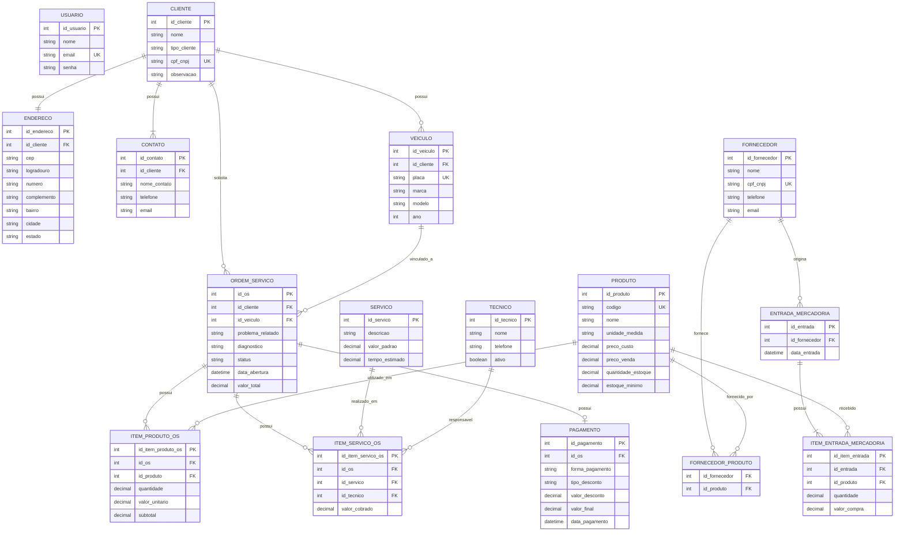

# Modelo de Dados

O diagrama consolida as estruturas repetidas nos casos de uso e o DER da fonte. É um modelo lógico, ainda não confrontado com o esquema real.

## Restrições derivadas

- `CLIENTE.cpf_cnpj` deve ser válido e único conforme [[RN-02 - CPF ou CNPJ válido e único|RN-02]].
- Todo cliente deve ser identificado como `PF` ou `PJ` conforme [[RN-01 - Identificação do cliente|RN-01]].
- Todo cliente deve possuir pelo menos um contato.
- `VEICULO.placa` deve ser válida e única.
- Um veículo deve estar vinculado a um único cliente.
- `PRODUTO.codigo` deve ser único.
- `PRODUTO.quantidade_estoque` não pode possuir quantidade negativa.
- `PRODUTO.estoque_minimo` determina o limite utilizado para geração do alerta de estoque mínimo.
- Quantidades de produtos utilizadas em uma O.S. devem ser maiores que zero.
- A quantidade utilizada na O.S. não pode exceder a quantidade disponível em estoque.
- `SERVICO.valor_padrao` é utilizado como valor inicial ao adicionar o serviço à O.S.
- `ITEM_SERVICO_OS.valor_cobrado` pode ser diferente de `SERVICO.valor_padrao` sem alterar o cadastro original do serviço.
- `SERVICO.tempo_estimado` deve ser maior que zero conforme [[RN-32 - Tempo estimado do serviço|RN-32]].
- Todo técnico recém cadastrado inicia como ativo conforme [[RN-33 - Técnico ativo|RN-33]].
- Somente técnicos ativos podem ser vinculados a novos serviços de uma O.S.
- Toda O.S. inicia com status `Aberta`.
- O status da O.S. deve respeitar as transições definidas nas regras de negócio.
- Uma O.S. pode possuir vários produtos e vários serviços.
- Uma O.S. pode não possuir pagamento enquanto não tiver sido finalizada.
- O pagamento deve registrar a forma de pagamento e, quando houver, o desconto aplicado.
- O desconto não pode resultar em valor final negativo.
- Uma entrada de mercadoria deve estar vinculada a um fornecedor e possuir pelo menos um item.
- Um fornecedor pode fornecer vários produtos e um produto pode ser fornecido por vários fornecedores.

## Diferenças e lacunas

- O sistema prevê autenticação de `USUARIO`, porém ainda não foram definidos diferentes perfis ou níveis de permissão.
- O cadastro de `VEICULO` não possui caso de uso próprio; o veículo é cadastrado durante a abertura da O.S. quando a placa informada ainda não existe.
- O sistema registra a forma de pagamento, mas não realiza processamento financeiro, parcelamento ou integração com meios de pagamento.
- Não foi definido controle de histórico das alterações realizadas pelos usuários, como qual usuário abriu, alterou ou finalizou uma O.S.

Veja também [[03_Modelo de Dominio/Dicionario de Dados|Dicionário de Dados]].

