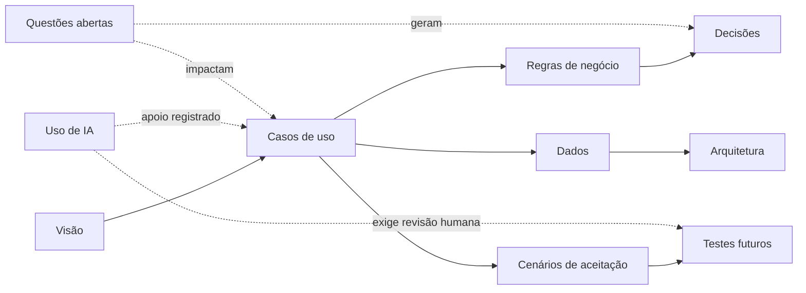

# SISMAT

> [!abstract] Em uma frase
> O SISMAT organiza solicitações internas de materiais desde o pedido até a análise, entrega e atualização do estoque.

> [!warning] Estado da evidência
> Esta documentação reflete a especificação emitida em 26/03/2026 e melhorias explicitamente marcadas como propostas. Ainda não foi validada contra uma implementação do SISMAT.

## Produto

- [[01_Produto/Visao do Produto|Visão do Produto]]
- [[01_Produto/Escopo e Contexto|Escopo e Contexto]]
- [[01_Produto/Atores e Stakeholders|Atores e Stakeholders]]
- [[01_Produto/Glossario|Glossário]]

## Requisitos

- [[02_Requisitos/Indice de Casos de Uso|Índice de Casos de Uso]]
- [[02_Requisitos/Regras de Negocio/Indice de Regras de Negocio|Índice de Regras de Negócio]]
- [[02_Requisitos/Requisitos Nao Funcionais|Requisitos Não Funcionais]]
- [[02_Requisitos/Catalogo de Mensagens|Catálogo de Mensagens]]

## Modelos e arquitetura

- [[03_Modelo de Dominio/Modelo de Dados|Modelo de Dados]]
- [[03_Modelo de Dominio/Dicionario de Dados|Dicionário de Dados]]
- [[03_Modelo de Dominio/Ciclo de Vida da Requisicao|Ciclo de Vida da Requisição]]
- [[04_Arquitetura/Visao de Arquitetura|Visão de Arquitetura]]
- [[04_Arquitetura/Diagramas de Sequencia|Diagramas de Sequência]]
- [[04_Arquitetura/Decisoes/Indice de Decisoes|Decisões de Arquitetura]]

## Qualidade e evolução

- [[05_Qualidade/Matriz de Rastreabilidade|Matriz de Rastreabilidade]]
- [[05_Qualidade/Cenarios de Aceitacao|Cenários de Aceitação]]
- [[05_Qualidade/Riscos e Questoes em Aberto|Riscos e Questões em Aberto]]
- [[06_Interfaces/Mapa de Interfaces|Mapa de Interfaces]]
- [[07_Operacao/Registro de Mudancas|Registro de Mudanças]]
- [[00_Inicio/Status da documentacao|Status da documentação]]

## Transparência e uso de IA

- [[09_UsoIA/Indice de Uso de IA|Índice de Uso de IA]]
- [[09_UsoIA/Etapas e Registro de Uso|Etapas e Registro de Uso]]
- [[09_UsoIA/Metodologia e Responsabilidades|Metodologia e Responsabilidades]]
- [[09_UsoIA/Impactos Riscos e Controles|Impactos, Riscos e Controles]]
- [[09_UsoIA/Declaracao de Transparencia|Declaração de Transparência]]

## Publicação

- [[01_Produto/Matriz de Integracao Curricular|Matriz de Integração Curricular]]
- [[08_Publicacao/Caderno do Projeto Integrador - SISMAT|Caderno do Projeto Integrador - SISMAT]]
- [[08_Publicacao/LEIA-ME - Geracao do PDF|Como gerar o PDF editorial]]
- [[08_Publicacao/VALIDACAO - Layout Academico|Validação do layout acadêmico]]
- [[output/pdf/SISMAT-Projeto-Integrador-v1.2.pdf|Abrir a última versão compilada]]
- [[90_Templates/Template - Caderno do Projeto Integrador|Template de publicação]]

## Visão navegável

Abra [[Mapa SISMAT.canvas|Mapa SISMAT]] para explorar o vault visualmente.

