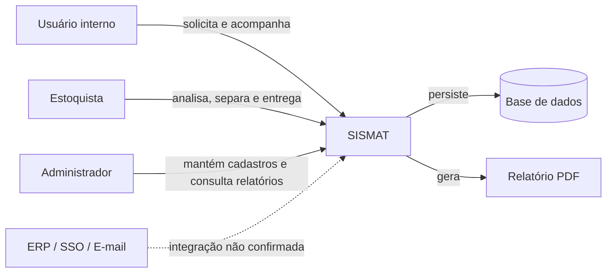

# Escopo e Contexto

## Dentro do escopo atual

- autenticação e acesso conforme perfil;
- cadastro e manutenção de produtos;
- cadastro e manutenção de usuários;
- criação de requisição com um ou vários itens;
- consulta de requisições próprias e de pedidos encerrados;
- análise, aprovação e rejeição com motivo;
- entrega total ou parcial;
- atualização do estoque e registro de movimentação;
- relatórios de estoque, movimentações e pedidos finalizados;
- exportação de relatórios em PDF.

## Fora do escopo ou não evidenciado

- compras e relacionamento com fornecedores;
- cotação, orçamento e contas a pagar;
- inventário físico e reconciliação;
- múltiplos almoxarifados ou transferências;
- reserva de estoque explicitamente definida;
- notificações por e-mail, SMS ou push;
- integrações com ERP, diretório corporativo ou SSO;
- trilha de auditoria detalhada;
- políticas de retenção e proteção de dados.

Os itens acima não devem ser interpretados como inexistentes na implementação; apenas não aparecem na fonte analisada.

## Contexto do sistema

## Premissas

- usuários possuem um perfil de acesso;
- produtos têm código, descrição, unidade e saldo;
- cada requisição pertence a um usuário e possui um ou mais itens;
- a entrega gera movimentação de estoque.

## Fronteiras a validar

Veja [[05_Qualidade/Riscos e Questoes em Aberto#QST-004 - Integrações|QST-004]] e [[05_Qualidade/Riscos e Questoes em Aberto#QST-006 - Múltiplos estoques|QST-006]].
