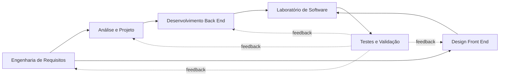

# Matriz de Integração Curricular

Esta matriz torna explícita a contribuição de cada disciplina para o mesmo produto, evitando entregas isoladas ou repetidas.

| Disciplina | Responsabilidade no projeto | Artefatos e evidências | Estado |
|---|---|---|---|
| Engenharia de Requisitos | compreender o problema e especificar o comportamento esperado | [[01_Produto/Visao do Produto\|visão]], [[01_Produto/Atores e Stakeholders\|stakeholders]], [[02_Requisitos/Indice de Casos de Uso\|casos de uso]], [[02_Requisitos/Regras de Negocio/Indice de Regras de Negocio\|regras]] e [[05_Qualidade/Matriz de Rastreabilidade\|rastreabilidade]] | documentação inicial disponível |
| Análise de Projetos de Software | transformar requisitos em modelos e decisões de solução | [[03_Modelo de Dominio/Modelo de Dados\|modelo de dados]], [[03_Modelo de Dominio/Ciclo de Vida da Requisicao\|estados]], [[04_Arquitetura/Visao de Arquitetura\|arquitetura]] e [[04_Arquitetura/Decisoes/Indice de Decisoes\|ADRs]] | modelo conceitual disponível |
| Design Front End | projetar interação, consistência visual e acessibilidade | [[06_Interfaces/Mapa de Interfaces\|mapa de interfaces]], protótipos `IMG-01` a `IMG-13` e [[02_Requisitos/Requisitos Nao Funcionais#RNF-005 - Acessibilidade\|RNF-005]] | protótipos disponíveis |
| Desenvolvimento Back End | implementar API, regras, persistência, segurança e relatórios | serviços, endpoints, esquema, autenticação, logs e testes de integração | a vincular ao código |
| Laboratório de Software - Projeto | integrar planejamento, implementação, validação e entrega | backlog, versões, aplicação executável, demonstração, testes e retrospectiva | a documentar |

## Fluxo de integração

## Evidências mínimas por ciclo

- [ ] requisito ou decisão alterada no mesmo ciclo da implementação;
- [ ] responsável e disciplina identificados;
- [ ] link para código, commit ou demonstração quando disponível;
- [ ] cenário de aceitação executado;
- [ ] resultado e pendências registrados;
- [ ] versão da entrega congelada para avaliação.

## Critério de conclusão

O projeto integrador estará documentalmente completo quando cada disciplina possuir pelo menos uma evidência aprovada e os principais casos de uso estiverem ligados à implementação e aos testes correspondentes.
