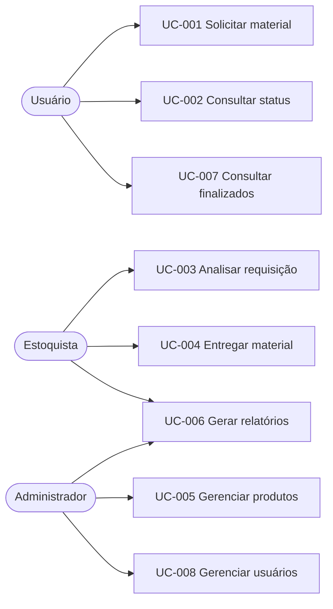

# Índice de Casos de Uso

| ID | Caso de uso | Ator principal | Estado documental |
|---|---|---|---|
| UC-001 | [[UC-001 - Cadastrar cliente\|Realizar requisição de material]] | Usuário | em revisão |
| UC-002 | [[UC-002 - Consultar clientes\|Consultar status da requisição]] | Usuário | em revisão |
| UC-003 | [[UC-003 - Cadastrar Técnico\|Analisar requisição]] | Estoquista | em revisão |
| UC-004 | [[UC-004 - Cadastrar Serviço\|Entregar material]] | Estoquista | em revisão |
| UC-005 | [[UC-005 - Cadastrar produto\|Gerenciar produtos]] | Administrador | em revisão |
| UC-006 | [[UC-006 - Registrar entrada de mercadoria\|Gerar relatórios]] | Administrador / Estoquista | em revisão |
| UC-007 | [[UC-007 - Cadastrar fornecedor\|Consultar pedidos finalizados]] | Usuário | em revisão |
| UC-008 | [[UC-008 - Alertar estoque mínimo\|Gerenciar usuários]] | Administrador | em revisão |

## Mapa de atores e capacidades

## Convenção dos fluxos

- **EV**: ação do ator ou outro evento externo.
- **RS**: resposta observável do sistema.
- Alternativas mantêm o objetivo do fluxo principal; exceções impedem ou interrompem sua conclusão.

## Diagrama original

Imagem extraída da página 6 da fonte. A versão Mermaid acima continua sendo a versão viva e editável.

![[06_Interfaces/Anexos/Diagramas da Fonte/Diagrama de Casos de Uso.png]]
