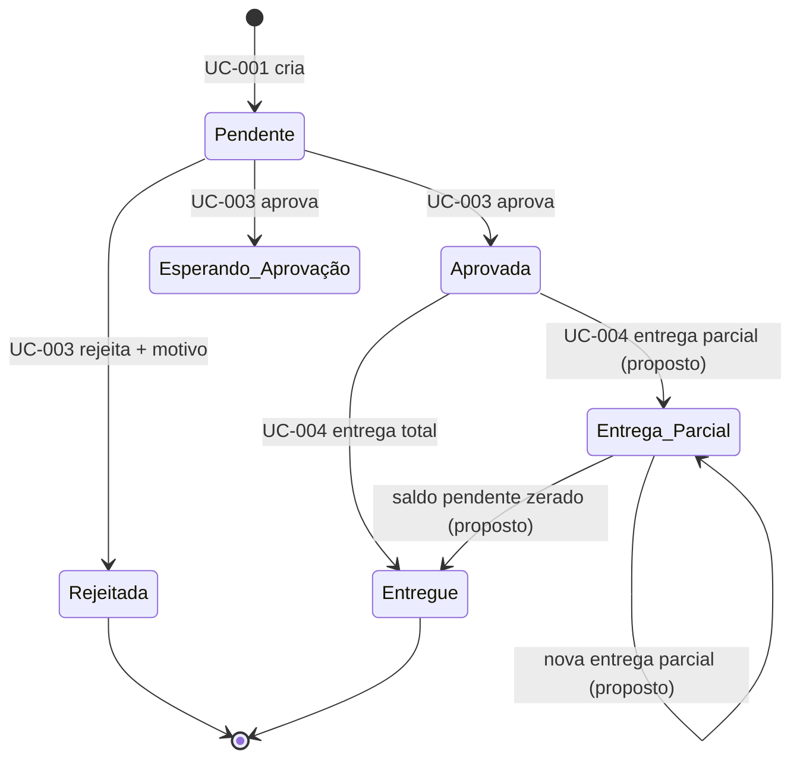

# Ciclo de Vida da Requisição

## Transições confirmadas pela fonte

| Origem | Destino | Ação | Regra |
|---|---|---|---|
| inexistente | Pendente | criar requisição | [[RN-03 - Contato obrigatório do cliente\|RN-03]] |
| Pendente | Aprovada | aprovar | [[RN-06 - Endereço vinculado ao cliente\|RN-06]] |
| Pendente | Rejeitada | rejeitar com motivo | [[RN-07 - Consulta do histórico do cliente\|RN-07]] |
| Aprovada | Entregue | confirmar entrega | [[RN-08 - Placa única do veículo\|RN-08]] |

## Parte proposta

`Entrega_Parcial` foi incluído para tornar o fluxo parcial representável, mas não existe na lista de status do PDF. A decisão depende de [[05_Qualidade/Riscos e Questoes em Aberto#QST-002 - Semântica da entrega parcial|QST-002]].

## Invariantes sugeridas

- estados terminais não voltam a estados ativos sem processo de correção auditado;
- toda transição registra ator e instante;
- a rejeição registra motivo;
- a entrega e o movimento de estoque são atômicos.
