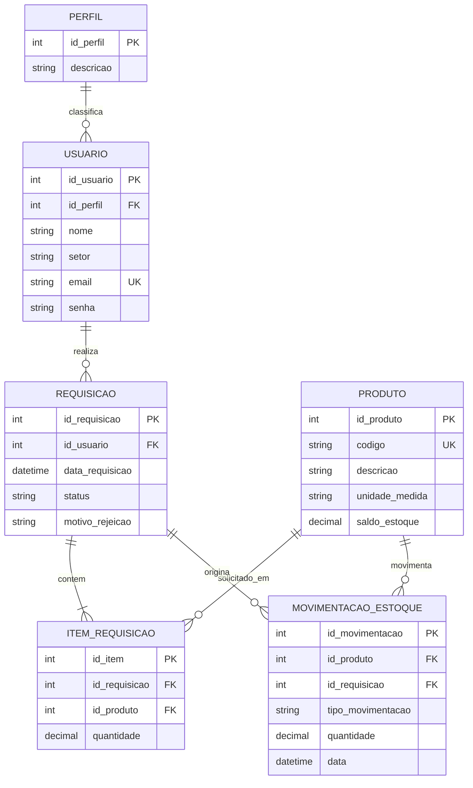

# Modelo de Dados

O diagrama consolida as estruturas repetidas nos casos de uso e o DER da fonte. É um modelo lógico, ainda não confrontado com o esquema real.

## Restrições derivadas

- `USUARIO.email` único: [[02_Requisitos/Regras de Negocio/RN-21 - Email unico|RN-21]].
- `PRODUTO.codigo` único: [[02_Requisitos/Regras de Negocio/RN-11 - Codigo de produto unico|RN-11]].
- `ITEM_REQUISICAO.quantidade > 0`: [[02_Requisitos/Regras de Negocio/RN-01 - Quantidade positiva|RN-01]].
- `PRODUTO.saldo_estoque >= 0`: [[02_Requisitos/Regras de Negocio/RN-10 - Estoque nao negativo|RN-10]].
- requisição deve possuir ao menos um item.

## Diferenças e lacunas

- `motivo_rejeicao` é necessário para [[02_Requisitos/Regras de Negocio/RN-07 - Rejeicao exige motivo|RN-07]], embora não apareça no quadro de campos da fonte.
- `id_requisicao` em movimentação aparece no texto do DER, mas não em todos os quadros de estruturas.
- o nome `senha` veio da fonte; a implementação deve armazenar hash/credencial conforme [[02_Requisitos/Requisitos Nao Funcionais#RNF-002 - Proteção de credenciais|RNF-002]].
- entrega parcial pode exigir entidade própria ou quantidades entregue/pendente por item.
- reserva de estoque pode exigir campo ou lançamento adicional; veja [[04_Arquitetura/Decisoes/ADR-001 - Momento da reserva e baixa de estoque|ADR-001]].

Veja também [[03_Modelo de Dominio/Dicionario de Dados|Dicionário de Dados]].

## DER original

Imagem extraída da página 33 do PDF para preservar a referência visual. O diagrama Mermaid desta página é a versão viva.

![[06_Interfaces/Anexos/Diagramas da Fonte/Diagrama Entidade Relacionamento.png]]
