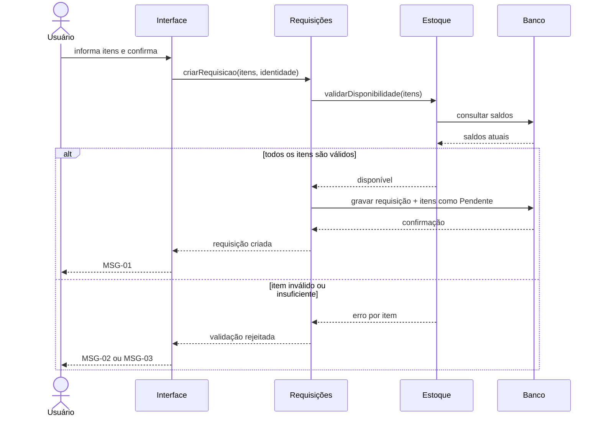
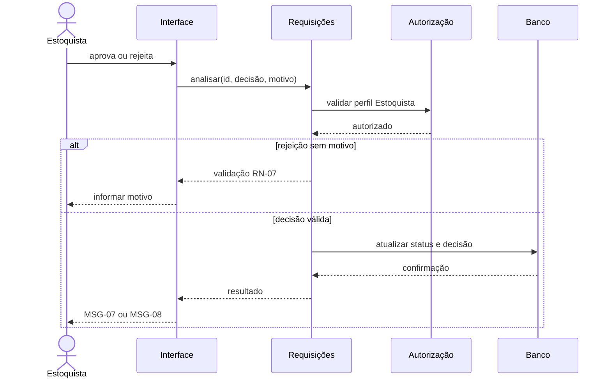
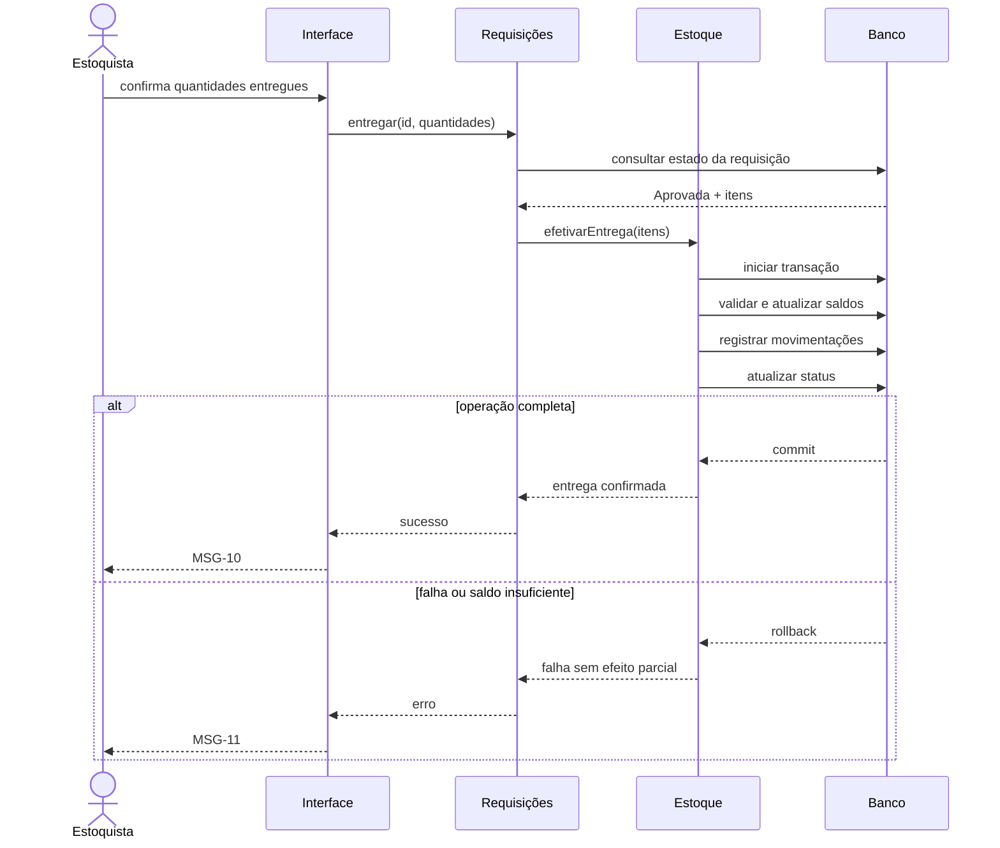

# Diagramas de Sequência

Os participantes representam responsabilidades conceituais, não classes ou serviços já confirmados.

## Criar requisição

## Analisar requisição

## Entregar material

## Impacto de decisões

A sequência de criação/análise muda se [[04_Arquitetura/Decisoes/ADR-001 - Momento da reserva e baixa de estoque|ADR-001]] for aprovada. Nesse caso, aprovação reserva quantidade e entrega converte reserva em saída física.
