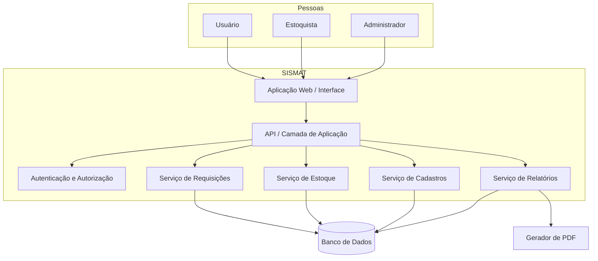

# Visão de Arquitetura

> [!warning] Modelo conceitual
> Não foi encontrado código-fonte do SISMAT. O diagrama organiza responsabilidades desejáveis e não afirma a tecnologia ou a estrutura atualmente implementada.

## Responsabilidades

| Componente conceitual | Responsabilidade |
|---|---|
| Interface | Capturar comandos, apresentar estados e erros acessíveis |
| Aplicação/API | Coordenar casos de uso e limites transacionais |
| Autenticação/Autorização | Identificar usuário e impor permissões no servidor |
| Requisições | Criar, consultar e alterar o ciclo de vida |
| Estoque | Calcular disponibilidade e registrar movimentos |
| Cadastros | Manter produtos, usuários e perfis |
| Relatórios | Consultar dados e gerar visualização/exportação |
| Banco | Preservar integridade, unicidade e histórico necessário |

## Princípios propostos

- o domínio não deve depender de detalhes da interface;
- saldo, movimentação e status devem compartilhar fronteira transacional quando uma entrega é confirmada;
- autorização e isolamento por usuário devem existir no servidor;
- relatórios não devem contornar regras de acesso;
- decisões que mudam o modelo devem ser registradas em [[04_Arquitetura/Decisoes/Indice de Decisoes|ADRs]].

## Integrações

Nenhuma integração externa foi confirmada. ERP, SSO e notificações permanecem fora da arquitetura até resolução de [[05_Qualidade/Riscos e Questoes em Aberto#QST-004 - Integrações|QST-004]].

## Diagrama de classes original

Imagem extraída da página 34 do PDF. Ela é mantida como evidência da linha de base; a arquitetura conceitual acima deve evoluir conforme o código real.

![[06_Interfaces/Anexos/Diagramas da Fonte/Diagrama de Classes.png]]
