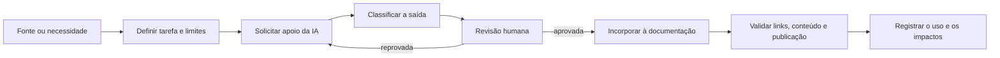

# Metodologia e Responsabilidades

## Fluxo adotado

## Responsabilidades

| Atividade | Apoio da IA | Responsabilidade da equipe |
|---|---|---|
| interpretação da fonte | localizar, resumir e relacionar informações | conferir sentido, contexto e fidelidade |
| redação | sugerir estrutura e texto inicial | revisar, corrigir e assumir a autoria da versão entregue |
| modelagem | propor diagramas e relações | validar regras, estados, entidades e decisões |
| conteúdo novo | sugerir artefatos e alternativas | decidir o que entra e marcar o que ainda é proposta |
| publicação | apoiar automação, estilo e verificação | confirmar dados acadêmicos e aprovar o layout |
| validação | executar verificações repetíveis | avaliar resultados e corrigir problemas encontrados |

## Controles aplicados

1. **Fonte preservada:** o documento original permanece separado e identificável.
2. **Rastreabilidade:** páginas derivadas mantêm origem, status e links relacionados.
3. **Separação de certeza:** fatos da fonte não são misturados silenciosamente com propostas.
4. **Revisão humana:** nenhuma saída de IA é considerada correta apenas por ter sido gerada.
5. **Versionamento:** mudanças relevantes entram no [[07_Operacao/Registro de Mudancas]].
6. **Validação editorial:** o PDF final é renderizado e inspecionado antes da entrega.
7. **Responsabilidade autoral:** a equipe responde pelo conteúdo incorporado.

## O que a IA não substitui

- validação com usuários, docentes ou responsáveis pelo almoxarifado;
- decisões de requisitos e arquitetura;
- comprovação de implementação por código, execução ou testes;
- avaliação acadêmica;
- revisão de informações pessoais, confidenciais ou institucionais;
- domínio técnico e capacidade de explicar o material apresentado.

## Dados e confidencialidade

Devem ser fornecidos à IA somente os dados necessários à tarefa e autorizados para esse uso. Informações pessoais, credenciais, segredos, bases de produção e dados institucionais restritos não devem ser incluídos. A presença do aviso de confidencialidade na linha de base exige que a equipe confirme as permissões aplicáveis antes de compartilhar o material fora do ambiente autorizado.

## Critério de aceitação de uma saída

Uma contribuição assistida por IA só pode entrar na entrega quando:

- sua origem e sua finalidade estiverem claras;
- a equipe conseguir explicar e defender o conteúdo;
- os vínculos com a fonte ou com uma decisão estiverem registrados;
- hipóteses e propostas estiverem identificadas;
- não houver contradição conhecida com os demais artefatos;
- as verificações proporcionais ao risco tiverem sido realizadas.

